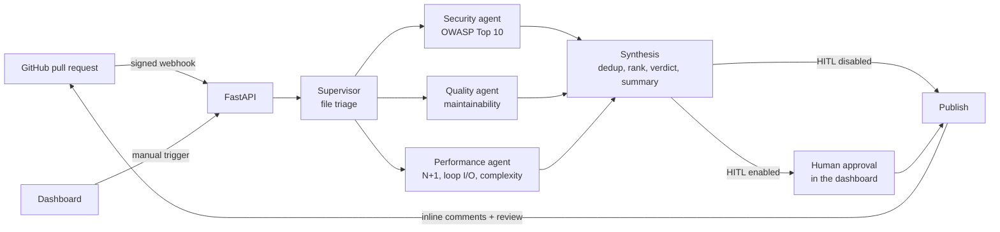

<div align="center">


# GitMind

**A multi-agent AI code reviewer for GitHub pull requests.**

GitMind reads every pull request, sends it to three specialist LLM agents working in parallel
(security, code quality, performance), merges their findings into a single review and posts it
back to GitHub, optionally after a human has checked it in a real-time dashboard.

[](https://github.com/gwatterson/gitmind/actions/workflows/ci.yml)
[](LICENSE)
[](https://python.org)
[](https://fastapi.tiangolo.com)
[](https://langchain-ai.github.io/langgraph/)
[](https://nextjs.org)
[](https://ai.google.dev)

</div>

---

## Highlights

- **Multi-agent pipeline on LangGraph.** A supervisor triages the changed files and fans them out to three specialist agents that run in parallel; a synthesis node deduplicates, ranks and summarizes their findings.
- **Structured, validated LLM output.** Every agent answers through a Pydantic schema, so findings arrive as typed objects instead of free text to be parsed.
- **Built to fail gracefully.** If one agent crashes the review still completes, clearly marked as incomplete; if all of them fail, or the daily LLM quota runs out, the review stops with an explicit status instead of a misleading "all clear".
- **Human in the loop.** Findings can wait in the dashboard, where a reviewer edits them and approves before anything is posted to GitHub.
- **Safe by default.** The bot never approves a pull request on its own, webhooks are verified and idempotent, and the dashboard is protected by GitHub sign-in with an allowlist.
- **Live reasoning trace.** The dashboard streams each step of the pipeline over Server-Sent Events while the agents work.
- **Proactive rate limiting.** LLM calls are throttled before hitting provider limits, across requests per minute, requests per day and tokens per minute.

---

## How it works



1. **Trigger.** A `pull_request` webhook (opened, synchronize, reopened, ready for review) or a manual request from the dashboard creates a review for the PR head commit.
2. **Triage.** The supervisor reads the diff and decides which files each agent should inspect. Every file always goes through the security agent.
3. **Parallel analysis.** The three agents run concurrently on Gemini 2.5 Flash and return typed findings with file, line, severity, rule id, explanation and suggested fix.
4. **Synthesis.** Findings are deduplicated and sorted by severity. The verdict (`request_changes`, `comment` or `approve`) is computed deterministically from the severities, never chosen by the model, and an LLM writes the human-readable summary.
5. **Approval and publishing.** With human-in-the-loop enabled the review waits in the dashboard; otherwise it is posted right away as inline comments plus a summary review.

A new commit on the same pull request supersedes the review still in progress, and the outdated review is never published.

---

## Features

### Review pipeline
- Supervisor, three specialist agents and a synthesis node, orchestrated as a LangGraph state graph with parallel fan-out and fan-in
- Agent errors collected through a LangGraph state reducer, so concurrent failures never crash the graph
- A review with a failed agent can never end with an `approve` verdict, and its summary names the agents that failed
- Deterministic fallback summary when the summary LLM call fails
- Proactive rate limiter on three dimensions (RPM, RPD, TPM); the daily counter is persisted and survives restarts

### GitHub integration
- Webhook receiver with HMAC-SHA256 signature verification that fails closed when no secret is configured
- Idempotent processing of redelivered webhooks (`X-GitHub-Delivery`) and deduplication by commit
- Draft pull requests skipped by default, payloads capped at GitHub's 25 MB limit
- Inline review comments on the diff plus a summary review; comments that cannot be placed are reported instead of failing the whole review
- Authentication through a GitHub App or, for development, a personal access token
- Standalone MCP server (stdio) exposing 8 tools: PR diff, file list, metadata, inline comment, summary review, semgrep scan, cyclomatic complexity (radon) and AST parsing

### Dashboard
- Next.js 14 dashboard with review list, aggregate metrics, findings by category and severity, and a live rate-limit gauge
- Review detail page with the streamed reasoning trace, severity and category filters, and a diff viewer that annotates the changed lines
- Human-in-the-loop actions: edit a finding, approve and post, reject and delete
- GitHub sign-in with user menu; administrator-only actions are hidden from other users

### Security
- GitHub OAuth sign-in with an allowlist of users and organizations, re-checked on every request
- Signed, HttpOnly session cookies; the GitHub access token is used once at sign-in and never stored
- Scoped API keys (`reviews:read`, `reviews:write`) for automation, stored only as SHA-256 hashes, with expiry and revocation
- CSRF protection through a required custom header on cookie-authenticated writes
- Role separation: only administrators can clear the archive and manage API keys
- HTTP rate limiting per client, plus a stricter per-user limit on manual review triggers
- Security headers on every response, and HSTS in production
- Internal errors reach clients only as an opaque reference id; details go to the logs
- Structured logs with automatic masking of tokens, keys and credentials
- Startup validation: with `ENVIRONMENT=production` the backend refuses to run with insecure settings, and the interactive API docs are disabled

---

## Design decisions

| Decision | Why |
|---|---|
| Parallel specialist agents instead of one large prompt | Each agent gets a focused prompt and schema, and the three run concurrently instead of one after another |
| Verdict computed in code from the findings | The model describes problems; whether a PR is blocked is a deterministic rule that can be tested and cannot be talked out of |
| The bot never posts `APPROVE` by itself | A pull request can contain text written to manipulate the model. Approving requires both a configuration flag and a human approval |
| Partial results are labeled, total failures are errors | An empty list of findings must mean "nothing found", not "the agents crashed" |
| Webhooks fail closed and are idempotent | GitHub retries deliveries and anyone can reach a public endpoint: without a valid signature nothing runs, and each delivery runs once |
| Rate limiting before the call, not after the 429 | Free and entry tiers have tight quotas; waiting proactively is cheaper than retrying rejected calls |

---

## Tech stack

| Layer | Technology |
|---|---|
| Agents and orchestration | LangGraph, LangChain Core, Pydantic structured output |
| LLM | Gemini 2.5 Flash (`langchain-google-genai`) |
| Backend | Python 3.11, FastAPI, SSE, structlog, slowapi |
| Auth | GitHub OAuth, JWT session cookies, hashed API keys |
| GitHub | PyGithub, GitHub App or personal access token, HMAC-verified webhooks |
| Static analysis tools | radon, Python AST, semgrep (optional) via an MCP server |
| Storage | SQLite (aiosqlite) |
| Frontend | Next.js 14, React 18, TypeScript, Tailwind CSS |
| Tooling | uv, Ruff, mypy, pytest, respx, ESLint, Prettier, pre-commit, GitHub Actions, Dependabot |

---

## Quick start

Requirements: Python 3.11+, [uv](https://docs.astral.sh/uv/), Node.js 20+, a [Gemini API key](https://aistudio.google.com/apikey).

```bash
git clone https://github.com/gwatterson/gitmind
cd gitmind
./start.sh        # macOS / Linux
start.bat         # Windows
```

The script installs the locked dependencies, creates `backend/.env` and `frontend/.env.local`
from the templates, and starts the backend on port 8000 and the dashboard on port 3000.

Then edit `backend/.env`. The minimum for a local run:

```bash
GEMINI_API_KEY=...          # LLM
GITHUB_TOKEN=...            # read PRs and post reviews (or configure a GitHub App)
AUTH_DISABLED=true          # local only: skip GitHub sign-in
```

For GitHub sign-in, webhooks, API keys and every other option, see the step-by-step [GUIDE.md](GUIDE.md).

---

## Configuration

All settings come from environment variables (`backend/.env`, see [`.env.example`](backend/.env.example)). The most important ones:

| Variable | Purpose |
|---|---|
| `ENVIRONMENT` | `development` or `production`; production enforces a secure configuration |
| `GEMINI_API_KEY`, `GEMINI_MODEL` | LLM credentials and model |
| `RATE_LIMIT_RPM_MAX`, `RATE_LIMIT_RPD_MAX`, `RATE_LIMIT_TPM_MAX` | LLM quota limits |
| `GITHUB_APP_ID`, `GITHUB_PRIVATE_KEY_PATH` or `GITHUB_TOKEN` | GitHub access |
| `GITHUB_WEBHOOK_SECRET` | Webhook signature secret (required for webhooks) |
| `GITHUB_OAUTH_CLIENT_ID`, `GITHUB_OAUTH_CLIENT_SECRET` | Dashboard sign-in |
| `AUTH_ALLOWED_USERS`, `AUTH_ALLOWED_ORGS`, `AUTH_ADMIN_USERS` | Who can sign in and who is an administrator |
| `SESSION_SECRET` | Signs session cookies (at least 32 characters in production) |
| `HITL_ENABLED` | Wait for human approval before posting to GitHub |
| `ALLOW_BOT_APPROVE` | Allow `APPROVE` reviews, only after a human approval |
| `REVIEW_DRAFT_PRS` | Also review draft pull requests |

---

## API

Interactive documentation is served at `/docs` in development.

| Method | Endpoint | Access | Description |
|---|---|---|---|
| `POST` | `/webhook/github` | GitHub signature | Webhook receiver |
| `GET` | `/auth/login`, `/auth/callback` | Public | GitHub OAuth sign-in flow |
| `GET` | `/auth/status` | Public | Whether GitHub sign-in is configured |
| `GET` | `/auth/me` | Signed in | Current user |
| `POST` | `/auth/logout` | Public | End the session |
| `GET` | `/api/reviews` | `reviews:read` | List reviews (paginated, filterable) |
| `GET` | `/api/reviews/{id}` | `reviews:read` | Review detail with findings and events |
| `GET` | `/api/reviews/{id}/diff` | `reviews:read` | Pull request diff for the viewer |
| `GET` | `/api/stream/{id}` | `reviews:read` | Live reasoning trace (SSE) |
| `POST` | `/api/reviews/trigger` | `reviews:write` | Start a review manually |
| `POST` | `/api/reviews/{id}/approve` | `reviews:write` | Approve and post to GitHub (HITL) |
| `PATCH` | `/api/reviews/{id}/findings/{finding_id}` | `reviews:write` | Edit a finding before posting |
| `DELETE` | `/api/reviews/{id}` | `reviews:write` | Delete a review |
| `DELETE` | `/api/reviews` | Administrator | Clear the archive |
| `GET`, `POST`, `DELETE` | `/api/keys` | Administrator | Manage API keys |
| `GET` | `/api/stats`, `/api/rate-limit/status` | `reviews:read` | Dashboard metrics |
| `GET` | `/api/health` | Public | Liveness probe |

Authenticate with the session cookie set by the sign-in flow (plus the `X-Requested-With: gitmind` header on writes) or with `Authorization: Bearer gm_...` for API keys.

---

## Testing and quality

```bash
cd backend
uv run pytest --cov   # no network access, temporary database
uv run ruff check . && uv run mypy
```

- The test suite covers authentication and OAuth (with GitHub mocked), webhook signature and idempotency, the full LangGraph pipeline with fake LLMs (including parallel agent failures and quota exhaustion), GitHub publishing, the rate limiter and log masking.
- CI runs lint, formatting, type checking and tests with an 80% coverage gate on the backend, lint, type checking and a production build on the frontend, plus secret scanning and dependency audits.
- pre-commit hooks run the same checks locally; Dependabot keeps dependencies up to date.

---

## Project structure

```
gitmind/
├── backend/
│   ├── app/
│   │   ├── main.py              # FastAPI app factory, middleware
│   │   ├── config.py            # Settings and production safety checks
│   │   ├── rate_limiter.py      # Three-dimension LLM rate limiter
│   │   ├── api/                 # Routes: auth, API keys, webhooks, reviews, SSE
│   │   ├── core/                # Security, errors, logging, HTTP rate limits
│   │   ├── services/            # Review runner, GitHub publisher
│   │   ├── github/              # Authenticated GitHub client
│   │   ├── graph/               # LangGraph pipeline
│   │   │   ├── supervisor.py    # File triage
│   │   │   ├── agents/          # Security, quality, performance agents
│   │   │   ├── synthesis.py     # Aggregation, verdict, summary
│   │   │   └── graph.py         # Graph construction and review runs
│   │   ├── db/                  # SQLite schema and queries
│   │   └── mcp_server/          # MCP server with 8 tools
│   ├── tests/                   # pytest suite
│   ├── pyproject.toml
│   └── uv.lock
├── frontend/                    # Next.js dashboard
│   └── src/
│       ├── app/                 # Pages: dashboard, review detail, sign-in
│       ├── components/          # Auth, stream, diff viewer, metrics, findings
│       └── lib/                 # Typed API client
├── .github/                     # CI and Dependabot
├── GUIDE.md                     # Setup and testing guide
└── start.sh / start.bat         # One-command local start
```

---

## License

Released under the [MIT License](LICENSE).
