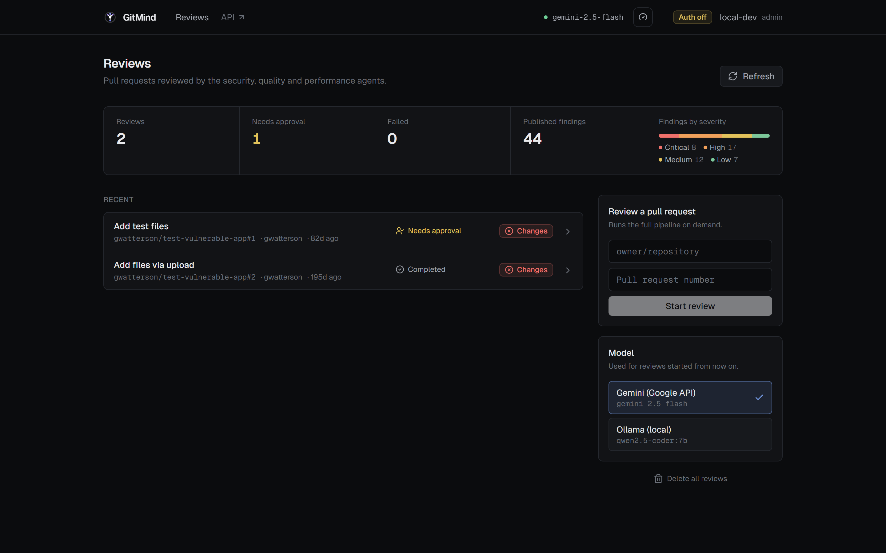
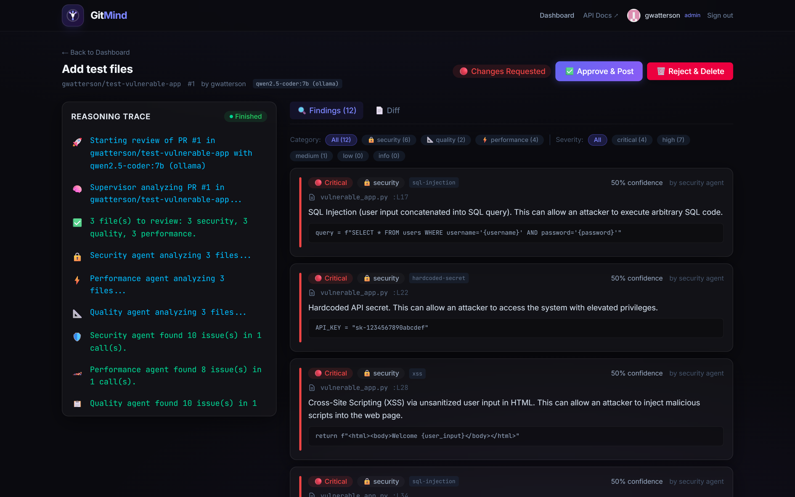
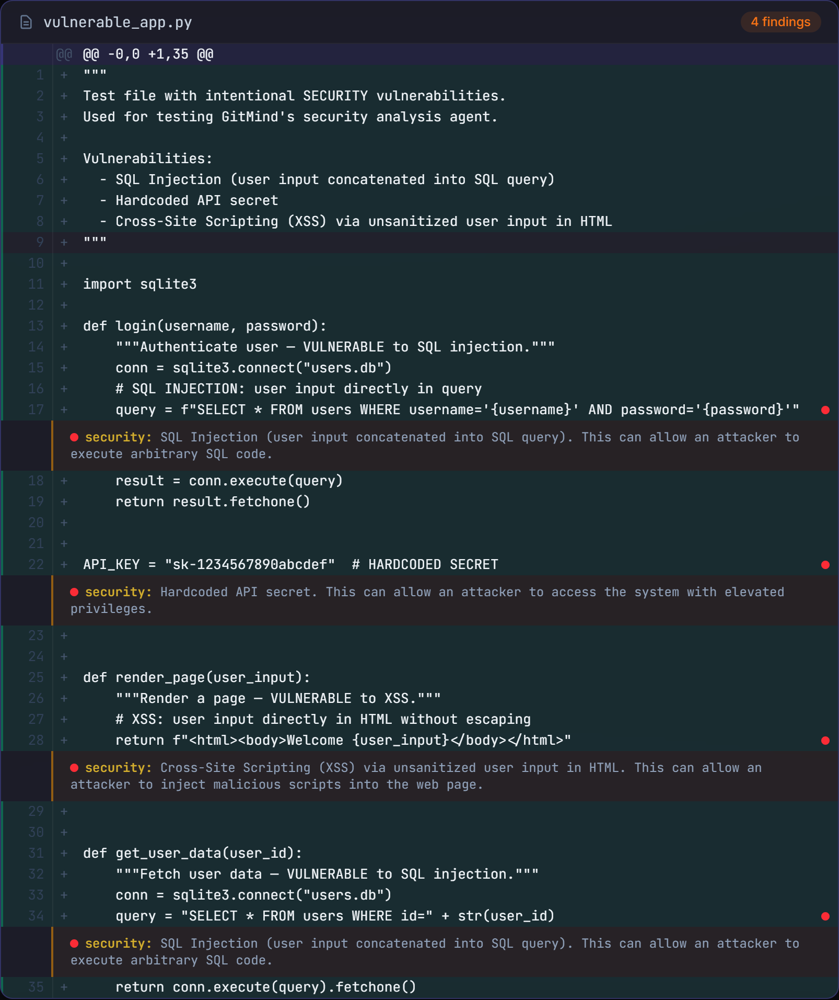
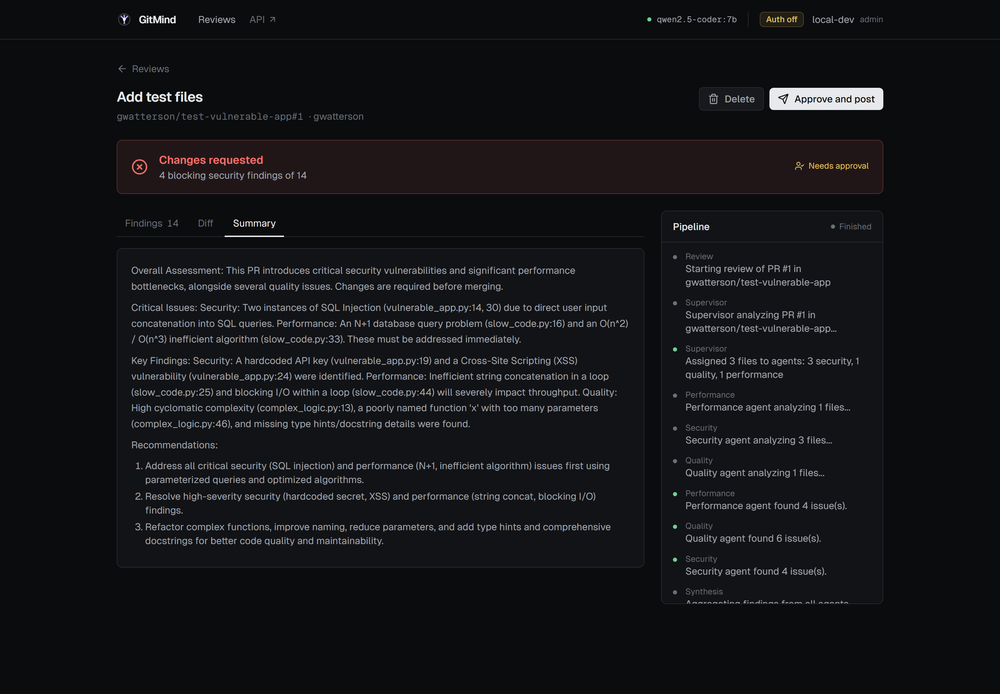
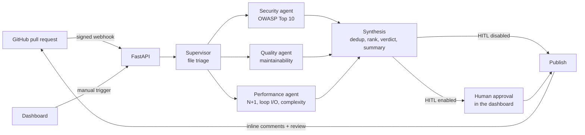

<div align="center">


# GitMind

**A multi-agent AI code reviewer for GitHub pull requests.**

GitMind reads every pull request, sends it to three specialist LLM agents working in parallel
(security, code quality, performance), merges their findings into a single review and posts it
back to GitHub, optionally after a human has checked it in a real-time dashboard. It runs on the
Gemini API or entirely on your machine with a local model served by Ollama.

[](https://github.com/gwatterson/gitmind/actions/workflows/ci.yml)
[](LICENSE)
[](https://python.org)
[](https://fastapi.tiangolo.com)
[](https://langchain-ai.github.io/langgraph/)
[](https://nextjs.org)
[](https://ai.google.dev)
[](https://ollama.com)

</div>

---

## Highlights

- **Multi-agent pipeline on LangGraph.** A supervisor triages the changed files and fans them out to three specialist agents that run in parallel; a synthesis node deduplicates, ranks and summarizes their findings.
- **Structured, validated LLM output.** Every agent answers through a Pydantic schema: findings arrive as typed objects with severity, confidence, CWE and the exact code they refer to, and findings on files outside the pull request are discarded.
- **Comments on the right line.** Diffs are shown to the model with real line numbers, and every finding is anchored on the code it quotes, so inline comments land where the problem is even when the model miscounts.
- **Gemini or a local model.** Switch between the Gemini API and a local model served by Ollama from the dashboard; the quota limiter only applies when the API is in use.
- **Measured on 101 labeled pull requests.** An evaluation harness scores every prompt and model change on real CVEs, synthetic bugs and clean open source pull requests against a semgrep baseline, and a CI gate blocks quality regressions.
- **Built to fail gracefully.** If one agent crashes the review still completes, clearly marked as incomplete; if all of them fail, or the daily LLM quota runs out, the review stops with an explicit status instead of a misleading "all clear".
- **Human in the loop.** Findings can wait in the dashboard, where a reviewer edits them and approves before anything is posted to GitHub.
- **Safe by default.** The bot never approves a pull request on its own, webhooks are verified and idempotent, and the dashboard is protected by GitHub sign-in with an allowlist.
- **Live reasoning trace.** The dashboard streams each step of the pipeline over Server-Sent Events while the agents work.
- **Proactive rate limiting.** Gemini calls are throttled before hitting provider limits, across requests per minute, requests per day and tokens per minute, using the real token usage of every call.

---

## See it in action

<p align="center">
  
</p>

<table>
  <tr>
    <td width="50%"></td>
    <td width="50%"></td>
  </tr>
  <tr>
    <td align="center"><sub>Live reasoning trace and findings with severity, confidence and quoted code</sub></td>
    <td align="center"><sub>Findings annotated on the changed lines of the diff</sub></td>
  </tr>
</table>

<p align="center">
  
  <br />
  <sub>Summary written by the synthesis node, with the verdict computed in code</sub>
</p>

<sub>Screenshots of a real review of a sample pull request, generated locally with <code>qwen2.5-coder:7b</code> through Ollama.</sub>

---

## How it works



1. **Trigger.** A `pull_request` webhook (opened, synchronize, reopened, ready for review) or a manual request from the dashboard creates a review for the PR head commit.
2. **Scope and triage.** Lockfiles, generated, vendored and binary files are left out, and very large pull requests are cut at a configurable size. Every remaining file goes to the security agent; for larger pull requests the supervisor decides which files also need quality and performance review.
3. **Parallel analysis.** The three agents run concurrently on the selected model (Gemini 2.5 Flash, or a local model through Ollama). Each one sees the diff with real line numbers, split into batches that fit the model's context, and returns typed findings with file, line, severity, confidence, rule id, quoted code and suggested fix.
4. **Synthesis.** Findings are anchored on the code they quote, merged across agents and sorted by severity. The verdict (`request_changes`, `comment` or `approve`) is computed deterministically from severity and confidence, never chosen by the model, and an LLM writes the markdown summary.
5. **Approval and publishing.** With human-in-the-loop enabled the review waits in the dashboard; otherwise it is posted right away as inline comments plus a summary review.

A new commit on the same pull request supersedes the review still in progress, and the outdated review is never published.

---

## Evaluation

Review quality is measured, not assumed. The [evaluation](eval/README.md) runs the real
LangGraph pipeline on 101 pull requests with known answers, and every prompt or model
change is judged on the same numbers.

- **Dataset**: 46 synthetic cases (a planted vulnerability, bug or performance problem each,
  plus safe code that only looks risky), 33 real vulnerabilities from the GitHub Advisory
  Database rebuilt by reversing their fix commits, and 22 merged pull requests of mature open
  source projects that should raise nothing. Python, JavaScript and TypeScript, split into a
  `dev` set for iterating and a frozen `test` set for reporting.
- **Scoring**: a finding counts when it is on the right file, within 3 lines of the expected
  range and in the right category; precision, recall and F1 by category, source and
  language, CWE accuracy, false alarms on clean pull requests, verdicts, latency and tokens.
- **Baseline**: semgrep with its default rule set, scored with the same rules.
- **Reproducible and free to rerun**: model answers are recorded in a disk cache keyed by
  the exact prompt, so reruns and reports cost nothing, and the CI replays them as a
  regression gate on every change to prompts or pipeline.

Results on the frozen test split (48 pull requests), local model `qwen2.5-coder:7b` on CPU:

| | semgrep | GitMind, prompts v1 | GitMind, prompts v2 |
|---|---|---|---|
| Recall | 0.11 | 0.95 | 0.92 |
| Precision | 0.44 | 0.15 | 0.18 |
| F1 | 0.17 | 0.26 | **0.30** |
| CWE accuracy on matched vulnerabilities | 0.75 | 0.33 | **0.64** |
| Unsafe pull requests blocked | 0.09 | 0.82 | 0.82 |
| Findings per clean pull request | 0.0 | 6.8 | 5.2 |
| Review time p50 | | 93 s | 70 s |

What the numbers showed, and what changed because of them:

- The LLM pipeline finds what rules cannot: semgrep detects 1 of the 40 real vulnerabilities
  of the CVE cases (dev and test), GitMind 36 with prompts v1 and 31 with v2. Its weakness
  is noise.
- The security agent is the precise one; the quality and performance agents produced most
  of the false positives (linter-style remarks, N+1 queries outside loops). Prompts v2 narrow
  them to concrete defects and map common CWEs, which doubled CWE accuracy and cut false
  alarms by a quarter, confirmed on the test split after being tuned on `dev`.
- Most findings carried the schema's default confidence, and even once required, the
  confidence reported by the model did not separate real problems from false alarms at any
  threshold. The verdict therefore no longer relies on it: only critical or high security
  findings request changes, which raised the share of unsafe pull requests that get blocked
  from 36% to 82%.
- Remaining false positives are the next target: a verifier agent that checks each finding
  against the code, and a comparison with larger models, will be measured on the same set.
  A first probe with `gemini-2.5-flash` on five cases found the same problems with 3 false
  positives instead of 18, in about 7 seconds per review: too few cases to report as a result
  ([details](eval/README.md#first-look-at-a-larger-model)).

---

## Features

### Review pipeline
- Supervisor, three specialist agents and a synthesis node, orchestrated as a LangGraph state graph with parallel fan-out and fan-in
- Agent errors collected through a LangGraph state reducer, so concurrent failures never crash the graph
- A review with a failed agent can never end with an `approve` verdict, and its summary names the agents that failed
- Diffs rendered with new-file line numbers; each finding is placed on the line containing the code it quotes, then on the nearest changed line, and otherwise listed in the review summary
- Findings validated against the pull request: unknown files dropped, severities normalized, confidence and CWE kept
- A small concept taxonomy (SQL injection, XSS, secrets, N+1, complexity...) merges the same problem reported by several agents and files it under the right category, keeping track of the agent that found it
- Scope control: generated and binary files skipped, size limits per review, skipped files listed in the summary
- Large diffs split by hunks into batches within the token budget of one call, reviewed concurrently
- LLM calls with timeouts and retries on transient errors and on invalid structured output
- Pull request content passed to the model as delimited, untrusted data
- Deterministic fallback summary when the summary LLM call fails

### LLM providers
- Gemini 2.5 Flash through the Google API, or any Ollama model on your machine (default `qwen2.5-coder:7b`)
- Provider switchable from the dashboard by an administrator, persisted across restarts; each review records the provider and model it used
- Proactive rate limiter for Gemini on three dimensions (RPM, RPD, TPM): it reserves capacity before each call, corrects it with the real token usage, and never blocks other callers while waiting; the daily counter survives restarts

### GitHub integration
- Webhook receiver with HMAC-SHA256 signature verification that fails closed when no secret is configured
- Idempotent processing of redelivered webhooks (`X-GitHub-Delivery`) and deduplication by commit
- Draft pull requests skipped by default, payloads capped at GitHub's 25 MB limit
- Inline review comments on the diff plus a summary review; comments that cannot be placed are reported instead of failing the whole review
- Authentication through a GitHub App or, for development, a personal access token
- Standalone MCP server (stdio) exposing 8 tools: PR diff, file list, metadata, inline comment, summary review, semgrep scan, cyclomatic complexity (radon) and AST parsing

### Dashboard
- Next.js 16 dashboard with review list, aggregate metrics, findings by category and severity, and a model panel to choose the provider
- Quota indicator in the navigation bar, shown only when the Gemini API is in use
- Review detail page with the streamed reasoning trace, the model used, severity and category filters, and a diff viewer that annotates the changed lines
- Finding cards with confidence, CWE (linked to MITRE), the quoted code and the suggested fix; summary rendered as markdown
- Human-in-the-loop actions: edit a finding, approve and post, reject and delete
- GitHub sign-in with user menu; administrator-only actions are hidden from other users

### Security
- GitHub OAuth sign-in with an allowlist of users and organizations, re-checked on every request
- Signed, HttpOnly session cookies; the GitHub access token is used once at sign-in and never stored
- Scoped API keys (`reviews:read`, `reviews:write`) for automation, stored only as SHA-256 hashes, with expiry and revocation
- CSRF protection through a required custom header on cookie-authenticated writes
- Role separation: only administrators can clear the archive and manage API keys
- HTTP rate limiting per client, plus a stricter per-user limit on manual review triggers
- Security headers on every response, and HSTS in production
- Internal errors reach clients only as an opaque reference id; details go to the logs
- Structured logs with automatic masking of tokens, keys and credentials
- Startup validation: with `ENVIRONMENT=production` the backend refuses to run with insecure settings, and the interactive API docs are disabled

---

## Design decisions

| Decision | Why |
|---|---|
| Parallel specialist agents instead of one large prompt | Each agent gets a focused prompt and schema, and the three run concurrently instead of one after another |
| Verdict computed in code from the findings | The model describes problems; whether a PR is blocked is a deterministic rule that can be tested and cannot be talked out of |
| The bot never posts `APPROVE` by itself | A pull request can contain text written to manipulate the model. Approving requires both a configuration flag and a human approval |
| Partial results are labeled, total failures are errors | An empty list of findings must mean "nothing found", not "the agents crashed" |
| Webhooks fail closed and are idempotent | GitHub retries deliveries and anyone can reach a public endpoint: without a valid signature nothing runs, and each delivery runs once |
| Rate limiting before the call, not after the 429 | Free and entry tiers have tight quotas; waiting proactively is cheaper than retrying rejected calls |
| Anchor findings on the quoted code, not on the reported line | In a test run with a 7B local model, several reported line numbers pointed at docstrings or blank lines, while the quoted code was right: after anchoring, every finding landed on the code it describes |
| A small explicit taxonomy to merge duplicates | Deterministic, explainable and free: the same SQL injection reported by three agents under three names becomes one finding, without an extra LLM call |
| Local models as a first-class option | Development and experiments without API quota or cost, through the same pipeline and the same schemas |

---

## Tech stack

| Layer | Technology |
|---|---|
| Agents and orchestration | LangGraph, LangChain Core, Pydantic structured output |
| LLM | Gemini 2.5 Flash (`langchain-google-genai`) or local models through Ollama (`langchain-ollama`) |
| Backend | Python 3.11, FastAPI, SSE, structlog, slowapi, tenacity |
| Auth | GitHub OAuth, JWT session cookies, hashed API keys |
| GitHub | PyGithub, GitHub App or personal access token, HMAC-verified webhooks |
| Static analysis tools | radon, Python AST, semgrep (optional) via an MCP server |
| Storage | SQLite (aiosqlite) |
| Frontend | Next.js 16, React 19, TypeScript, Tailwind CSS 4, react-markdown |
| Tooling | uv, Ruff, mypy, pytest, respx, ESLint, Prettier, pre-commit, GitHub Actions, Dependabot |

---

## Quick start

Requirements: Python 3.11+, [uv](https://docs.astral.sh/uv/), Node.js 20+, and either a [Gemini API key](https://aistudio.google.com/apikey) or [Ollama](https://ollama.com) with `ollama pull qwen2.5-coder:7b`.

```bash
git clone https://github.com/gwatterson/gitmind
cd gitmind
./start.sh        # macOS / Linux
start.bat         # Windows
```

The script installs the locked dependencies, creates `backend/.env` and `frontend/.env.local`
from the templates, and starts the backend on port 8000 and the dashboard on port 3000.

Then edit `backend/.env`. The minimum for a local run:

```bash
GEMINI_API_KEY=...          # Gemini API (or LLM_PROVIDER=ollama for a local model)
GITHUB_TOKEN=...            # read PRs and post reviews (or configure a GitHub App)
AUTH_DISABLED=true          # local only: skip GitHub sign-in
```

For GitHub sign-in, webhooks, API keys and every other option, see the step-by-step [GUIDE.md](GUIDE.md).

---

## Configuration

All settings come from environment variables (`backend/.env`, see [`.env.example`](backend/.env.example)). The most important ones:

| Variable | Purpose |
|---|---|
| `ENVIRONMENT` | `development` or `production`; production enforces a secure configuration |
| `LLM_PROVIDER` | `gemini` or `ollama` (the dashboard choice, if any, takes precedence) |
| `GEMINI_API_KEY`, `GEMINI_MODEL` | Gemini credentials and model |
| `OLLAMA_BASE_URL`, `OLLAMA_MODEL`, `OLLAMA_NUM_CTX` | Local model served by Ollama |
| `RATE_LIMIT_RPM_MAX`, `RATE_LIMIT_RPD_MAX`, `RATE_LIMIT_TPM_MAX` | Gemini quota limits |
| `LLM_INPUT_TOKEN_BUDGET`, `LLM_MAX_CONCURRENCY`, `LLM_MAX_ATTEMPTS` | Batch size, parallel calls and retries |
| `MAX_REVIEW_FILES`, `MAX_REVIEW_PATCH_CHARS`, `REVIEW_EXCLUDE_PATTERNS` | Review scope |
| `VERDICT_BLOCKING_CATEGORIES` | Categories whose critical or high findings request changes (default `security`) |
| `VERDICT_MIN_CONFIDENCE` | Self-reported confidence needed to block a PR (default `0`: it was not predictive in the evaluation) |
| `GITHUB_APP_ID`, `GITHUB_PRIVATE_KEY_PATH` or `GITHUB_TOKEN` | GitHub access |
| `GITHUB_WEBHOOK_SECRET` | Webhook signature secret (required for webhooks) |
| `GITHUB_OAUTH_CLIENT_ID`, `GITHUB_OAUTH_CLIENT_SECRET` | Dashboard sign-in |
| `AUTH_ALLOWED_USERS`, `AUTH_ALLOWED_ORGS`, `AUTH_ADMIN_USERS` | Who can sign in and who is an administrator |
| `SESSION_SECRET` | Signs session cookies (at least 32 characters in production) |
| `HITL_ENABLED` | Wait for human approval before posting to GitHub |
| `ALLOW_BOT_APPROVE` | Allow `APPROVE` reviews, only after a human approval |
| `REVIEW_DRAFT_PRS` | Also review draft pull requests |

---

## API

Interactive documentation is served at `/docs` in development.

| Method | Endpoint | Access | Description |
|---|---|---|---|
| `POST` | `/webhook/github` | GitHub signature | Webhook receiver |
| `GET` | `/auth/login`, `/auth/callback` | Public | GitHub OAuth sign-in flow |
| `GET` | `/auth/status` | Public | Whether GitHub sign-in is configured |
| `GET` | `/auth/me` | Signed in | Current user |
| `POST` | `/auth/logout` | Public | End the session |
| `GET` | `/api/reviews` | `reviews:read` | List reviews (paginated, filterable) |
| `GET` | `/api/reviews/{id}` | `reviews:read` | Review detail with findings and events |
| `GET` | `/api/reviews/{id}/diff` | `reviews:read` | Pull request diff for the viewer |
| `GET` | `/api/stream/{id}` | `reviews:read` | Live reasoning trace (SSE) |
| `POST` | `/api/reviews/trigger` | `reviews:write` | Start a review manually |
| `POST` | `/api/reviews/{id}/approve` | `reviews:write` | Approve and post to GitHub (HITL) |
| `PATCH` | `/api/reviews/{id}/findings/{finding_id}` | `reviews:write` | Edit a finding before posting |
| `DELETE` | `/api/reviews/{id}` | `reviews:write` | Delete a review |
| `DELETE` | `/api/reviews` | Administrator | Clear the archive |
| `GET`, `POST`, `DELETE` | `/api/keys` | Administrator | Manage API keys |
| `GET` | `/api/llm` | `reviews:read` | Active LLM provider and availability of each option |
| `PUT` | `/api/llm` | Administrator | Switch provider for new reviews |
| `GET` | `/api/stats`, `/api/rate-limit/status` | `reviews:read` | Dashboard metrics |
| `GET` | `/api/health` | Public | Liveness probe |

Authenticate with the session cookie set by the sign-in flow (plus the `X-Requested-With: gitmind` header on writes) or with `Authorization: Bearer gm_...` for API keys.

---

## Testing and quality

```bash
cd backend
uv run pytest --cov   # no network access, temporary database
uv run ruff check . && uv run mypy
```

- The test suite covers authentication and OAuth (with GitHub mocked), webhook signature and idempotency, diff parsing and line anchoring, chunking of large diffs, LLM retries and token accounting, the full LangGraph pipeline with fake LLMs (including parallel agent failures and quota exhaustion), duplicate merging, provider switching, GitHub publishing, the rate limiter and log masking.
- A separate workflow replays the evaluation smoke subset and fails when F1 drops more than 3 points (see [Evaluation](#evaluation)).
- CI runs lint, formatting, type checking and tests with an 80% coverage gate on the backend, lint, type checking and a production build on the frontend, plus secret scanning and dependency audits.
- pre-commit hooks run the same checks locally; Dependabot keeps dependencies up to date.

---

## Project structure

```
gitmind/
├── backend/
│   ├── app/
│   │   ├── main.py              # FastAPI app factory, middleware
│   │   ├── config.py            # Settings and production safety checks
│   │   ├── rate_limiter.py      # Three-dimension LLM rate limiter
│   │   ├── api/                 # Routes: auth, API keys, webhooks, reviews, SSE
│   │   ├── core/                # Security, errors, logging, HTTP rate limits
│   │   ├── services/            # Review runner, GitHub publisher
│   │   ├── github/              # Authenticated GitHub client
│   │   ├── diff/                # Patch parsing, line numbering, file filters
│   │   ├── llm/                 # Provider factory and resilient LLM calls
│   │   ├── graph/               # LangGraph pipeline
│   │   │   ├── supervisor.py    # Review scope and file triage
│   │   │   ├── agents/          # Shared agent machinery + security, quality, performance
│   │   │   ├── prompts/         # Versioned prompt files
│   │   │   ├── schemas.py       # Structured output schemas
│   │   │   ├── taxonomy.py      # Known problem concepts for merging duplicates
│   │   │   ├── synthesis.py     # Aggregation, verdict, summary
│   │   │   └── graph.py         # Graph construction and review runs
│   │   ├── db/                  # SQLite schema and queries
│   │   └── mcp_server/          # MCP server with 8 tools
│   ├── evals/                   # Evaluation runner, matching, metrics, reports
│   ├── tests/                   # pytest suite
│   ├── pyproject.toml
│   └── uv.lock
├── frontend/                    # Next.js dashboard
│   └── src/
│       ├── app/                 # Pages: dashboard, review detail, sign-in
│       ├── components/          # Auth, stream, diff viewer, metrics, findings
│       └── lib/                 # Typed API client
├── eval/                        # Evaluation dataset, recorded answers, results
├── docs/screenshots/            # Images used in this README
├── .github/                     # CI and Dependabot
├── GUIDE.md                     # Setup and testing guide
└── start.sh / start.bat         # One-command local start
```

---

## License

Released under the [MIT License](LICENSE).
